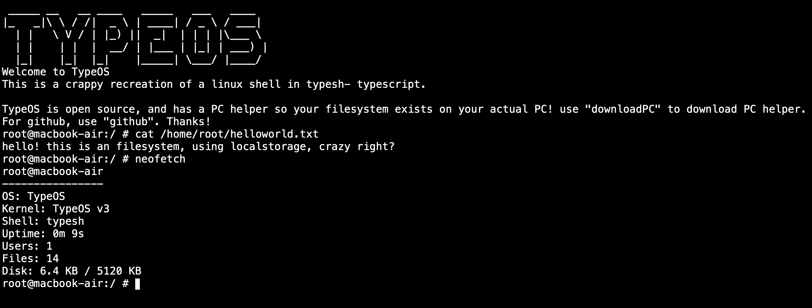

# typeos

An OS in typescript (somehow)

# huh
TypeOS is an os in Typescript. It is not a traditional OS in the sense that there is a desktop or an actual filesystem.

TypeOS is a **WEB** application mimicking a linux shell, and it does a pretty good job at it.

The filesystem uses localstorage (wow) to save data. You can alternatively use PC helper to backup your data or to put files onto TypeOS

It has its own package manager

# setup
if you want to try typeos, follow these steps or just use the demo https://typeos-demo.stacik.dev

1.clone/download the repo

2.go to websiteitself dir in the folder u downloaded

3.make sure u have node if not then download it along with npm

4.open a terminal in the folder and type "npm i"

5.press enter

6.wait for everything to download

7.once everything downloaded type "npm run dev"

8.press enter, you will be given a link to run typeos

if you close the terminal/reboot your pc you will no longer be able to visit the link, to revisit it, do these steps

1.open the websiteitself dir

2.open terminal in the folder

3.enter "npm run dev"

4.press enter, tada u will be able to access it again, magic right

# i wanna host this on my server

do everything in setup section until 6, after that follow this:

7.instead of npm run dev, you do npm run build, this builds the website

8.you will get a folder dist/

9.you may now copy everything from dist/ into a folder where your server 
will read the html files, you can run your server as normal

if you modify the project, please make sure to indicate it

if you sell the project, we will sue you (LICENSE)

# whats the pc helper thing how do i set it up
1.download latest from github releases (or just type downloadPC in the TypeOS terminal)

2.place it in a folder (like in Documents)

3.open a terminal in the folder you placed it in

4.on windows: .\pchelper(blablabla)

  on linux or mac ./pchelper(blablabla)

5.it will ask for how much mb u want to allocate (changeable later)

6.it will give you a key & instructions to attach TypeOS with it

7.done! the typeos file system is now attached to your actual file system

# where is the filesystem located?? (pc helper)

on windows: %APPDATA%\TypeOS\filesystem\

on linux: ~/.config/TypeOS/filesystem/

on macos: ~/Library/Application Support/TypeOS/filesystem/

# u used ai for this!!!! omg!!
yes, minor ai has been used, and you can't blame me, imagine making a goddamn OS in a browser, with a lot of limitations, and as a solo developer. still most of the OS is all done by myself

# is there a package manager?
of course, TypeOS comes with a package manager. You may use it to download JS packages that other users uploaded. To see how to use it in TypeOS type "typepkg --help".

# how do i upload to the package manager?
go to https://typeos.stacik.dev, create an account, go to the upload tab, fill in everything, and submit. i will have to review the package to make sure its safe (within 1 or 2 hours) and then your package will be published

# can PC helper rm -rf / my pc?
PC Helper is unable to access any other folder other than the specific folder on your system designed to contain your TypeOS files. All file operations make sure that you can't just ../ out of the directory and access external files.
